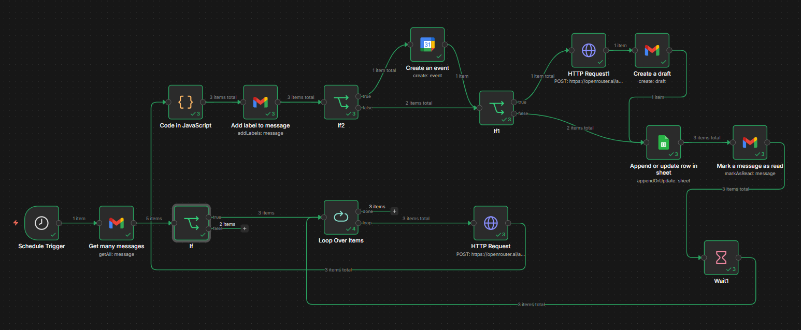

# 📬 AI Gmail Summarizer


-yellow?style=flat-square)


> Automatically fetches unread Gmail messages, analyzes them using GPT-4o-mini via OpenRouter, applies Gmail labels, logs results to Google Sheets, creates Google Calendar events for detected meetings, drafts AI-generated replies when needed, and marks emails as read — all on a schedule.

---

## 📋 Table of Contents

- [Overview](#overview)
- [Workflow Screenshot](#workflow-screenshot)
- [Workflow Diagram](#workflow-diagram)
- [Node Breakdown](#node-breakdown)
- [Prerequisites](#prerequisites)
- [Setup](#setup)
- [Configuration](#configuration)

---

## Overview

This n8n workflow runs on a **five-minute schedule**, picks up to **5 unread emails**, and for each one:

1. **Analyzes** the email using GPT-4o-mini — extracting a summary, category, priority, needs-reply flag, meeting details, and confidence score
2. **Applies a Gmail label** based on the detected category (work, finance, personal, promotion, meeting, spam, urgent)
3. **Creates a Google Calendar event** if a meeting is detected with high confidence (>80)
4. **Drafts an AI-generated reply** if the email requires a response
5. **Logs all metadata and the summary** to a Google Sheets spreadsheet
6. **Marks the email as read** to avoid reprocessing

---

## Workflow Screenshot


---

## Workflow Diagram

```
┌─────────────────┐     ┌──────────────────┐     ┌──────┐
│ Schedule Trigger│────▶│ Get many messages│────▶│  If  │
│ (every 5 min)   │     │  (5 unread mails)│     │(has  │
└─────────────────┘     └──────────────────┘     │text?)│
                                                  └──┬───┘
                                                     │ TRUE
                                         ┌───────────▼──────────┐
                                         │   Loop Over Items    │◀─────────────┐
                                         └───────────┬──────────┘              │
                                                     │ each item               │
                                         ┌───────────▼──────────┐              │
                                         │    HTTP Request      │              │
                                         │  (OpenRouter/GPT)    │              │
                                         │  Analyze email →     │              │
                                         │  summary, category,  │              │
                                         │  priority, meeting,  │              │
                                         │  needs_reply         │              │
                                         └───────────┬──────────┘              │
                                                     │                         │
                                         ┌───────────▼──────────┐              │
                                         │  Code in JavaScript  │              │
                                         │  (Parse JSON + map   │              │
                                         │   Gmail label IDs)   │              │
                                         └───────────┬──────────┘              │
                                                     │                         │
                                         ┌───────────▼──────────┐              │
                                         │  Add label to        │              │
                                         │  message (Gmail)     │              │
                                         └───────────┬──────────┘              │
                                                     │                         │
                                         ┌───────────▼──────────┐              │
                          ┌──────────────│   If2: Meeting       │              │
                          │ TRUE         │   detected?          │              │
                          │              └───────────┬──────────┘              │
              ┌───────────▼──────────┐               │ FALSE                   │
              │  Create Calendar     │    ┌───────────▼──────────┐             │
              │  Event (Google Cal)  │    │   If1: Needs reply?  │             │
              └───────────┬──────────┘    └──────┬───────────────┘             │
                          │              TRUE ───▶│        FALSE ──────────┐   │
                          └──────────────────────▶│                        │   │
                                         ┌────────▼─────────┐              │   │
                                         │  HTTP Request1   │              │   │
                                         │  (Generate draft │              │   │
                                         │   reply via GPT) │              │   │
                                         └────────┬─────────┘              │   │
                                                  │                        │   │
                                         ┌────────▼─────────┐              │   │
                                         │  Create a draft  │              │   │
                                         │  (Gmail draft)   │              │   │
                                         └────────┬─────────┘              │   │
                                                  └──────────────┬─────────┘   │
                                                                 │             │
                                         ┌───────────────────────▼──────────┐  │
                                         │  Append or update row in sheet   │  │
                                         │  (Id, Sender, Summary, Category, │  │
                                         │   Priority, NeedsReply,          │  │
                                         │   MeetingDetected, Confidence)   │  │
                                         └───────────────────┬──────────────┘  │
                                                             │                 │
                                         ┌───────────────────▼──────────────┐  │
                                         │     Mark message as read         │  │
                                         └───────────────────┬──────────────┘  │
                                                             │                 │
                                         ┌───────────────────▼──────────────┐  │
                                         │         Wait (3 seconds)         │──┘
                                         └──────────────────────────────────┘
```

---

## Node Breakdown

<details>
<summary><strong>⏱️ Schedule Trigger</strong></summary>

- **Type:** `n8n-nodes-base.scheduleTrigger`
- **Interval:** Every 5 minutes
- Kicks off the entire workflow automatically.

</details>

<details>
<summary><strong>📥 Get Many Messages</strong></summary>

- **Type:** `n8n-nodes-base.gmail`
- **Operation:** `getAll`
- **Limit:** 5 messages per run
- **Filter:** `is:unread` — only fetches unread emails
- **Credential:** Gmail OAuth2

</details>

<details>
<summary><strong>🔀 If (Text Check)</strong></summary>

- **Type:** `n8n-nodes-base.if`
- Checks whether the email's `text` field exists (non-empty)
- Only emails with body text proceed to processing; others are dropped silently

</details>

<details>
<summary><strong>🔁 Loop Over Items</strong></summary>

- **Type:** `n8n-nodes-base.splitInBatches`
- Iterates over each email one at a time
- Feeds back into itself via the **Wait** node after each email is processed

</details>

<details>
<summary><strong>🤖 HTTP Request (AI Analysis)</strong></summary>

- **Type:** `n8n-nodes-base.httpRequest`
- **Endpoint:** `https://openrouter.ai/api/v1/chat/completions`
- **Model:** `gpt-4o-mini`
- **Temperature:** `0.1` for consistent, deterministic outputs
- **Auth:** HTTP Header Auth (Bearer token via OpenRouter)
- Sends the full email body (From, Subject, Body) and returns structured JSON with:
  - `summary` — a concise summary of the email
  - `category` — one of: `work`, `finance`, `personal`, `promotion`, `meeting`, `spam`, `urgent`
  - `priority` — one of: `Low`, `Medium`, `High`
  - `needs_reply` — boolean
  - `meeting_detected` — boolean
  - `meeting_title`, `meeting_date` (YYYY-MM-DD), `meeting_time` (HH:MM), `meeting_end_time` (HH:MM)
  - `confidence` — integer 0–100

</details>

<details>
<summary><strong>💻 Code in JavaScript (Parse & Label Mapping)</strong></summary>

- **Type:** `n8n-nodes-base.code`
- Parses the raw GPT JSON response (strips markdown fences if present)
- Maps the detected `category` to a Gmail Label ID using a hardcoded label map:

  | Category | Label |
  |---|---|
  | work | `Label_3272446732333660500` |
  | finance | `Label_9122724880040644594` |
  | personal | `Label_2113930991147229230` |
  | promotion | `Label_2389672418718472155` |
  | meeting | `Label_8971484299382553051` |
  | spam | `Label_8953554111217387453` |
  | urgent | `Label_5791745347457165281` |

- Outputs a flat JSON object with all parsed fields plus `gmail_label`

</details>

<details>
<summary><strong>🏷️ Add Label to Message</strong></summary>

- **Type:** `n8n-nodes-base.gmail`
- **Operation:** `addLabels`
- Applies the mapped Gmail label to the email for visual organization in the inbox
- **Credential:** Gmail OAuth2 (account 2)

</details>

<details>
<summary><strong>🔀 If2 (Meeting Detection Check)</strong></summary>

- **Type:** `n8n-nodes-base.if`
- Routes to **Create Calendar Event** only when ALL three conditions are true:
  1. `meeting_detected === true`
  2. `meeting_date` is non-empty
  3. `confidence > 80`
- Otherwise routes to the **needs_reply** check

</details>

<details>
<summary><strong>📅 Create an Event (Google Calendar)</strong></summary>

- **Type:** `n8n-nodes-base.googleCalendar`
- **Calendar:** Configured to your Google account calendar
- **Start:** `meeting_date` + `meeting_time` in ISO format (IST, no timezone conversion)
- **End:** `meeting_date` + `meeting_end_time` (defaults to start + 1 hour if no end time in email)
- **Credential:** Google Calendar OAuth2

</details>

<details>
<summary><strong>🔀 If1 (Needs Reply Check)</strong></summary>

- **Type:** `n8n-nodes-base.if`
- Routes to **HTTP Request1** (draft generation) if `needs_reply === true`
- Otherwise routes directly to **Append or Update Row**

</details>

<details>
<summary><strong>✍️ HTTP Request1 (Draft Reply Generation)</strong></summary>

- **Type:** `n8n-nodes-base.httpRequest`
- **Endpoint:** `https://openrouter.ai/api/v1/chat/completions`
- **Model:** `gpt-4o-mini`
- Generates a professional email reply based on the original sender, subject, and snippet
- **Auth:** HTTP Header Auth (Bearer token via OpenRouter)

</details>

<details>
<summary><strong>📨 Create a Draft</strong></summary>

- **Type:** `n8n-nodes-base.gmail`
- **Resource:** `draft`
- Creates a Gmail draft with subject `Re: <original subject>` and the AI-generated reply body
- **Credential:** Gmail OAuth2 (account 2)

</details>

<details>
<summary><strong>📊 Append or Update Row in Sheet</strong></summary>

- **Type:** `n8n-nodes-base.googleSheets`
- **Operation:** `appendOrUpdate`
- Matches rows by `Id` and writes all fields to **Sheet1**:
  - `Id`, `Sender`, `Timestamp`, `Summary`, `Category`, `Priority`, `NeedsReply`, `MeetingDetected`, `Confidence`
- **Spreadsheet:** [Email summaries](https://docs.google.com/spreadsheets/d/1QTQ1TJ_h2ODZf6x873ONonL2D4sullW_bo681hGx3Ko)

</details>

<details>
<summary><strong>✅ Mark Message as Read</strong></summary>

- **Type:** `n8n-nodes-base.gmail`
- **Operation:** `markAsRead`
- Marks the processed email as read so it won't be picked up on the next run

</details>

<details>
<summary><strong>⏳ Wait (Rate Limiting)</strong></summary>

- **Type:** `n8n-nodes-base.wait`
- **Duration:** 3 seconds
- Adds a delay between emails to avoid hitting API rate limits
- Loops back into **Loop Over Items** after waiting

</details>

---

## Prerequisites

| Requirement | Details |
|---|---|
| n8n instance | Self-hosted or n8n Cloud |
| Gmail account | With OAuth2 credentials configured in n8n (two accounts: one for reading/marking, one for labeling/drafting) |
| Google Sheets account | With OAuth2 credentials configured in n8n |
| Google Calendar account | With OAuth2 credentials configured in n8n |
| OpenRouter API key | Sign up at [openrouter.ai](https://openrouter.ai) |
| Google Sheet | A sheet with columns: `Id`, `Timestamp`, `Sender`, `Summary`, `Category`, `Priority`, `NeedsReply`, `MeetingDetected`, `Confidence` |
| Gmail Labels | Create the 7 category labels in Gmail and update the label ID map in the **Code in JavaScript** node |

---

## Setup

1. **Import the workflow** into your n8n instance via `Workflows → Import from file`

2. **Configure credentials:**
   - `Gmail account` → Gmail OAuth2 (for reading, marking as read)
   - `Gmail account 2` → Gmail OAuth2 (for applying labels and creating drafts)
   - `Google Sheets account` → Google Sheets OAuth2
   - `Google Calendar account` → Google Calendar OAuth2
   - `Header Auth account` → Set `Authorization: Bearer <YOUR_OPENROUTER_API_KEY>`

3. **Update the Google Sheet ID** in the Sheets node if using your own spreadsheet

4. **Create the Sheet columns** in Sheet1:
   ```
   Id | Timestamp | Sender | Summary | Category | Priority | NeedsReply | MeetingDetected | Confidence
   ```

5. **Create Gmail labels** for each category and update the label ID map in the **Code in JavaScript** node:
   ```javascript
   const labels = {
     work:      "Label_XXXXXXXXXXXXXXX",
     finance:   "Label_XXXXXXXXXXXXXXX",
     personal:  "Label_XXXXXXXXXXXXXXX",
     promotion: "Label_XXXXXXXXXXXXXXX",
     meeting:   "Label_XXXXXXXXXXXXXXX",
     spam:      "Label_XXXXXXXXXXXXXXX",
     urgent:    "Label_XXXXXXXXXXXXXXX",
     default:   "Label_XXXXXXXXXXXXXXX"
   };
   ```
   > To find a label's ID, use the Gmail API or inspect network requests in n8n when selecting labels.

6. **Update the Google Calendar** ID in the **Create an event** node to match your calendar email

7. **Activate the workflow** by toggling it on in n8n

---

## Configuration

| Parameter | Location | Default | Description |
|---|---|---|---|
| Email fetch limit | `Get many messages` | `5` | Max emails fetched per run |
| Gmail filter | `Get many messages` | `is:unread` | Change to any Gmail search query |
| AI model | `HTTP Request` → JSON body | `gpt-4o-mini` | Swap for any OpenRouter-supported model |
| AI temperature | `HTTP Request` → JSON body | `0.1` | Lower = more consistent outputs |
| Meeting confidence threshold | `If2` | `80` | Minimum confidence to create a calendar event |
| Wait duration | `Wait1` | `3 seconds` | Delay between emails (increase if rate-limited) |
| Schedule interval | `Schedule Trigger` | Every 5 minutes | Adjust as needed |
| Calendar ID | `Create an event` | `sonisrushti12@gmail.com` | Your Google Calendar email |
