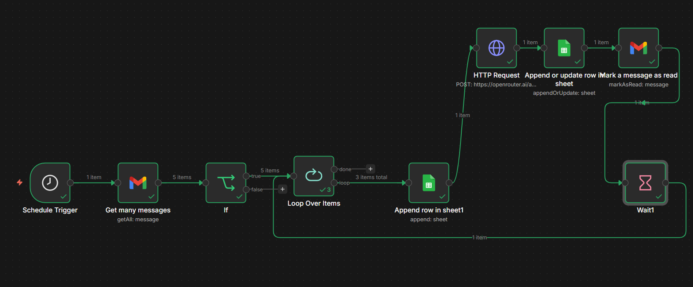

# 📬 AI Gmail Summarizer


-yellow?style=flat-square)

> Automatically fetches unread Gmail messages, summarizes them using GPT-4o-mini via OpenRouter, logs them to a Google Sheet, and marks them as read — all on a schedule.

---

## 📋 Table of Contents

- [Overview](#overview)
- [Workflow Diagram](#workflow-diagram)
- [Node Breakdown](#node-breakdown)
- [Prerequisites](#prerequisites)
- [Setup](#setup)
- [Configuration](#configuration)

---

## Overview

This n8n workflow runs on a **five minute schedule**, picks up to **5 unread emails**, summarizes each one into **3 bullet points** using an LLM, and appends the results to a **Google Sheets spreadsheet**. After logging, each email is marked as read to avoid reprocessing.

---

## 📸 Workflow Screenshot


---

## Workflow Diagram

```
┌─────────────────┐     ┌──────────────────┐       ┌──────┐
│ Schedule Trigger│────▶│ Get many messages│────▶ │  If  |
│ (every 5 minute)│     │  (5 unread mails)│       │(has  │
└─────────────────┘     └──────────────────┘       │snip?)│
                                                   └──┬───┘
                                                      │ TRUE
                                          ┌──────────▼──────────┐
                                          │   Loop Over Items   │◀────────┐
                                          └──────────┬──────────┘         │
                                                     │ each item          │
                                          ┌──────────▼──────────┐         │
                                          │  Append row in      │         │
                                          │  Sheet1 (metadata)  │         │
                                          └──────────┬──────────┘         │
                                                     │                    │
                                          ┌──────────▼──────────┐         │
                                          │   HTTP Request      │         │
                                          │  (OpenRouter/GPT)   │         │
                                          └──────────┬──────────┘         │
                                                     │                    │
                                          ┌──────────▼──────────┐         │
                                          │ Append or update    │         │
                                          │ row (add Summary)   │         │
                                          └──────────┬──────────┘         │
                                                     │                    │
                                          ┌──────────▼──────────┐         │
                                          │ Mark message as read│         │
                                          └──────────┬──────────┘         │
                                                     │                    │
                                          ┌──────────▼──────────┐         │
                                          │  Wait (3 seconds)   │─────────┘
                                          └─────────────────────┘
```

---

## Node Breakdown

<details>
<summary><strong>⏱️ Schedule Trigger</strong></summary>

- **Type:** `n8n-nodes-base.scheduleTrigger`
- **Interval:** Every 5 minute
- Kicks off the entire workflow automatically.

</details>

<details>
<summary><strong>📥 Get Many Messages</strong></summary>

- **Type:** `n8n-nodes-base.gmail`
- **Operation:** `getAll`
- **Limit:** 5 messages per run
- **Filter:** `is:unread` — only fetches unread emails
- **Credential:** Gmail OAuth2

</details>

<details>
<summary><strong>🔀 If (Snippet Check)</strong></summary>

- **Type:** `n8n-nodes-base.if`
- Checks whether the email's `snippet` field exists (non-empty)
- Only emails with a snippet proceed to processing; others are dropped silently

</details>

<details>
<summary><strong>🔁 Loop Over Items</strong></summary>

- **Type:** `n8n-nodes-base.splitInBatches`
- Iterates over each email one at a time
- Feeds back into itself via the **Wait** node after each email is processed

</details>

<details>
<summary><strong>📊 Append Row in Sheet1 (Metadata)</strong></summary>

- **Type:** `n8n-nodes-base.googleSheets`
- **Operation:** `append`
- Logs email metadata to **Sheet1** of the Google Sheet:
  - `Id` — Gmail message ID
  - `Sender` — From address
  - `Subject` — Email subject
  - `Timestamp` — Current time (`$now`)
- **Spreadsheet:** [Email summaries](https://docs.google.com/spreadsheets/d/1QTQ1TJ_h2ODZf6x873ONonL2D4sullW_bo681hGx3Ko)

</details>

<details>
<summary><strong>🤖 HTTP Request (AI Summarization)</strong></summary>

- **Type:** `n8n-nodes-base.httpRequest`
- **Endpoint:** `https://openrouter.ai/api/v1/chat/completions`
- **Model:** `gpt-4o-mini`
- **Prompt:** Summarizes each email into 3 bullet points using the `snippet` field
- **Auth:** HTTP Header Auth (Bearer token via OpenRouter)

</details>

<details>
<summary><strong>📝 Append or Update Row (Add Summary)</strong></summary>

- **Type:** `n8n-nodes-base.googleSheets`
- **Operation:** `appendOrUpdate`
- Matches rows by `Id` and writes the `Summary` column with the LLM response
- Updates the same row created in the previous Sheets step

</details>

<details>
<summary><strong>✅ Mark Message as Read</strong></summary>

- **Type:** `n8n-nodes-base.gmail`
- **Operation:** `markAsRead`
- Marks the processed email as read so it won't be picked up on the next run

</details>

<details>
<summary><strong>⏳ Wait (Rate Limiting)</strong></summary>

- **Type:** `n8n-nodes-base.wait`
- **Duration:** 3 seconds
- Adds a delay between processing emails to avoid hitting API rate limits
- Loops back into **Loop Over Items** after waiting

</details>

---

## Prerequisites

| Requirement | Details |
|---|---|
| n8n instance | Self-hosted or n8n Cloud |
| Gmail account | With OAuth2 credentials configured in n8n |
| Google Sheets account | With OAuth2 credentials configured in n8n |
| OpenRouter API key | Sign up at [openrouter.ai](https://openrouter.ai) |
| Google Sheet | A sheet with columns: `Id`, `Timestrap`, `Sender`, `Subject`, `Summary` |

---

## Setup

1. **Import the workflow** into your n8n instance via `Workflows → Import from file`

2. **Configure credentials:**
   - `Gmail account` → Gmail OAuth2
   - `Google Sheets account` → Google Sheets OAuth2
   - `Header Auth account` → Set `Authorization: Bearer <YOUR_OPENROUTER_API_KEY>`

3. **Update the Google Sheet ID** in both Sheets nodes if using your own spreadsheet

4. **Create the Sheet columns** in Sheet1:
   ```
   Id | Timestrap | Sender | Subject | Summary
   ```

5. **Activate the workflow** by toggling it on in n8n

---

## Configuration

| Parameter | Location | Default | Description |
|---|---|---|---|
| Email fetch limit | `Get many messages` | `5` | Max emails fetched per run |
| Gmail filter | `Get many messages` | `is:unread` | Change to any Gmail search query |
| AI model | `HTTP Request` → JSON body | `gpt-4o-mini` | Swap for any OpenRouter-supported model |
| Wait duration | `Wait1` | `3 seconds` | Delay between emails (increase if rate-limited) |
| Schedule interval | `Schedule Trigger` | Every 5 minute | Adjust as needed |

---

